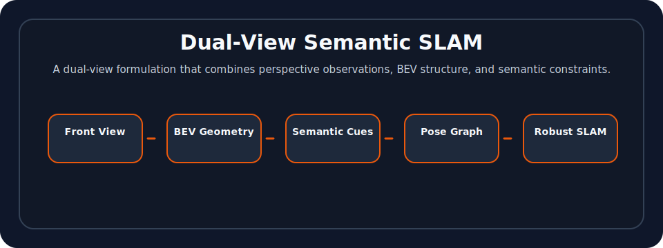

# Dual-View Semantic SLAM

<p align="center">
  
  
  
  
</p>

[中文](#中文说明) | [English](#english)

## Contents

- [Overview](#english)
- [Visual overview](#visual-overview)
- [Example visual assets](#example-visual-assets)
- [Repository structure](#repository-structure)
- [Related publication](#related-publication)
- [Citation](#citation)
- [License](#license)
- [中文说明](#中文说明)


## English

A visual SLAM research prototype that combines **front-view camera observations**, **bird's-eye-view geometry**, and **semantic cues** for autonomous-driving localization and mapping.

The project explores how multi-view geometric information and semantic scene structure can improve visual localization robustness in road environments.

## Motivation

Autonomous-driving scenes are challenging for monocular SLAM because of low-texture road surfaces, dynamic objects, repetitive structures, and large viewpoint changes. A dual-view formulation can provide complementary constraints:

- front-view image features for visual tracking;
- bird's-eye-view structure for road-layout consistency;
- semantic cues for more stable scene understanding;
- optimization modules for trajectory and map consistency.

## Main ideas

- Dual-view SLAM pipeline with front-view and BEV observations.
- Semantic feature usage for robust tracking and matching.
- Motion-prior assisted matching in driving scenes.
- Re-localization / re-initialization logic for tracking failure cases.
- ORB-SLAM-style architecture with pose-graph and bundle-adjustment components.

## Visual overview

<p align="center">
  
</p>

## Example visual assets

<p align="center">
  
  
</p>

The repository includes example mask assets used by the monocular / semantic SLAM pipeline. They are useful for understanding how view constraints and semantic masks are represented in the project.

## Repository structure

```text
.
├── Examples/Monocular/       # Main example entry point and example mask assets
├── include/                   # SLAM headers
├── src/                       # SLAM implementation
├── Thirdparty/                # Bundled DBoW2 and g2o dependencies
├── CMakeLists.txt
├── build.sh
└── README.md
```

## Build and run

This repository keeps one main example executable:

```text
Examples/Monocular/mono_bird_sem
```

Build the bundled third-party dependencies and the main project with:

```bash
./build.sh
```

The bird's-eye-view odometry module depends on `pclomp / ndt_omp`. If it is installed outside the default compiler search paths, pass the location through CMake cache variables, for example:

```bash
cmake -S . -B build \
  -DPCL_OMP_INCLUDE_DIR=/path/to/ndt_omp/include \
  -DPCL_OMP_LIBRARY=/path/to/libndt_omp.so
cmake --build build
```

Example invocation:

```bash
./Examples/Monocular/mono_bird_sem \
  path/to/ORBvoc.txt \
  Examples/Monocular/fisheye.yaml \
  path/to/sequence
```

The sequence directory is expected to provide the association / ground-truth text files and image paths used by `Examples/Monocular/mono_bird_sem.cc`. Local datasets and vocabulary files are intentionally not tracked in this repository.

## Keywords

`semantic SLAM`, `visual SLAM`, `bird's-eye view`, `BEV`, `fisheye camera`, `autonomous driving`, `visual localization`, `pose graph optimization`, `bundle adjustment`

## Related publication

This repository contains experimental code related to the ideas in the following paper:

- [**Hierarchical Multi-Level Information Fusion for Robust and Consistent Visual SLAM**](https://ieeexplore.ieee.org/document/9613790/)

The code should be treated as a **research prototype / partial implementation**, not as an official or complete reproduction of the paper.

## Project status

This is a research prototype. It may require dependency and dataset-path adaptation before being used in a modern environment.


## Citation

If you use this repository, please cite or acknowledge it using the metadata in [`CITATION.cff`](CITATION.cff).

## License

This repository is released under the [GNU General Public License v3.0](LICENSE), unless otherwise stated. Third-party components remain under their original licenses. This repository includes ORB-SLAM2-style components and bundled DBoW2 / g2o code; please also check the license files in `Thirdparty/`.

---

## 中文说明

这是一个面向自动驾驶场景的视觉 SLAM 研究原型，尝试融合 **前视图像观测**、**鸟瞰图 / BEV 几何信息** 和 **语义线索** 来提升定位与建图的鲁棒性。

项目关注的问题是：在道路场景中，单目视觉 SLAM 容易受到低纹理、动态物体、重复结构和视角变化影响；如果引入 BEV 结构和语义信息，是否能够提供更稳定的几何约束。


## 引用与许可

如果你使用该仓库，请通过 [`CITATION.cff`](CITATION.cff) 引用或致谢该项目。许可协议见 [`LICENSE`](LICENSE)。
